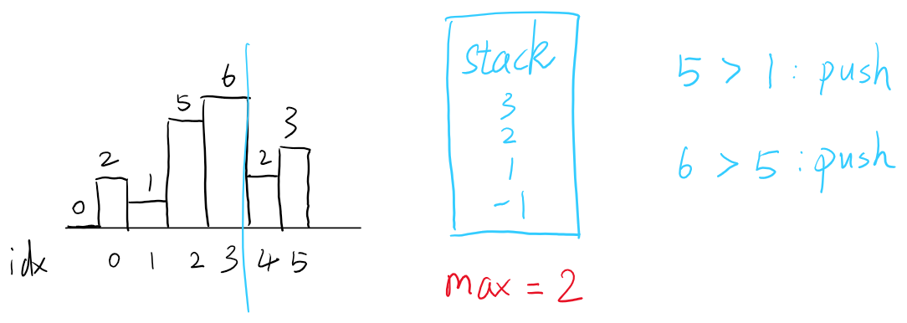
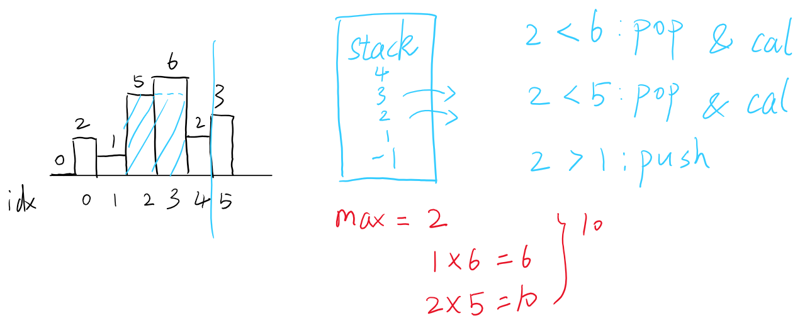
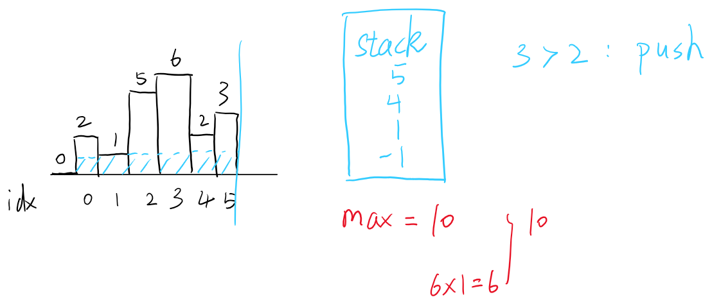

## 1. 问题描述

- 给定一个非零直方图，找出当中面积最大的矩形，并返回其面积。如下图所示。

    

## 2. 思路

- 比较直观的解法是用`分治法`
  - 分：把直方图分成左、右两部分，可用递归简单实现；
  - 治：最大面积可能来自左半部分、右半部分以及中间部分；
  - 合：用双指针，逐步向两边扩张，找出最大面积。
  - 分治法的时间复杂度为$O(n\log{n})$
- 这里主要讲解使用`栈`的算法[^1]：
  - 最大面积可以看做是高度和宽度的tradeoff。
  - 每次遇到较高的元素，可能会产生最大面积。
  - 故可一次遍历：
    1. 若遇到更高的元素，则压栈，作为最大面积的可能`参与者`；
    2. 若遇到更低的元素，则将之前更高元素逐个出栈，并计算可能的最大面积；
    3. 最后会计算最大宽度、最低高度情况的面积。
  - 关于边界条件：
    1. `stack = [-1]`: 确保第一个元素能进栈；
    2. `heights.append(0)`: 确保最后能计算上面遍历中的c情况，同时也是上一条的前置条件。
  - 看不懂没关系，后面附录有图文说明；
  - 由于只有一次遍历，故时间复杂度为$O(n)$。

## 3. 代码

代码比较简单，关键还是理解思路。
```python
def largestRectangleArea(self, heights: List[int]) -> int:
    stack, res = [-1], 0
    heights.append(0)
    for i, height in enumerate(heights):
        while height < heights[stack[-1]]:
            h = heights[stack.pop()]
            w = i - stack[-1] - 1
            print(h , w)
            res = max(h * w, res)
        stack.append(i)
    return res
```

## 4. 总结

个人觉得会用`分治法`解决这道题算及格了，`栈`的算法对逻辑思维要求比较高（for me）。

## 5. 参考

[^1]: [Largest Rectangle In Histogram](https://abhinandandubey.github.io/posts/2019/12/15/Largest-Rectangle-In-Histogram.html)

## 6. 附录

- 关于用`栈`的算法遍历
  1. 遍历前：`heights`数组在最后补一个`0`（图中放在前面），`stack`初始元素为`-1`；
    
  2. 开始遍历，第0个元素为`2`，比栈顶元素0大，有机会参与最大面积的运算，故压栈，继续遍历；
    
  3. 第1个元素为`1`，比栈顶元素`2`小，因为如果栈中较大元素要与当前元素一起计算面积，其高度会被限制，**因此要先把栈中比当前元素大的元素依次出栈，并分别参与计算面积，并暂存当前最大面积**。这里只要1个元素`2`比当前元素`1`大，故只出栈和计算面积1次；然后再把当前元素压栈，直到后面遇到比它还小的元素，再出栈参与面积运算。
    
  4. 第2、3个元素为`5`、`6`，均比栈顶元素大，故依次压栈。
    
  5. 第4个元素为`2`，比栈顶元素`6`小。与步骤3相同，先将栈顶元素`6`出栈，并计算面积。**这里计算面积的宽度是以当前元素下标为基准**，故宽度为1，面积为$1\times6=6$；同样地，再将栈顶元素`5`出栈，并计算面积得$2\times5=10$.暂存最大面积为10。
    
  6. 第5个元素为`6`，比栈顶元素`2`大，压栈。
  7. 第6个元素为`0`（算法添加），一定比栈顶元素小，因此会把栈内所有有效元素出栈，最后计算的面积是最低高度`min(heights)`与最大宽度`len(heights)`的乘积，其面积为$6\times1=6$。最后记录到最大面积为12。
    